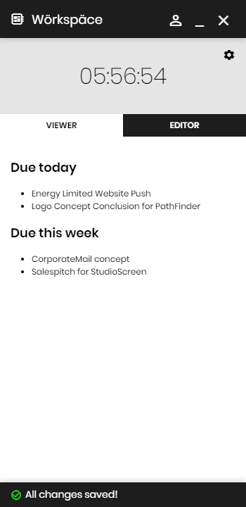

# wörkspäce

### What is it?
wörkspäce is a little helper application for your workspace! It features a todo list area that saves across sessions and a handy timer for the current day.

### features
* Easy to use UI
* Countdown Clock
* Markdown-powered notes section

### How to use?
Either open the installer or open the wörkspäce.exe from the portable folder.

### Build instructions
First you need to pull the project and install all node & electron dependencies
`npm install`

Now you can build your own flavor of wörkspäce. If you want to build a standalone "portable" version, you build wörkspäce with the following command.
`npm run pack`

If you want an installer, use the following command.
`npm run dist`
